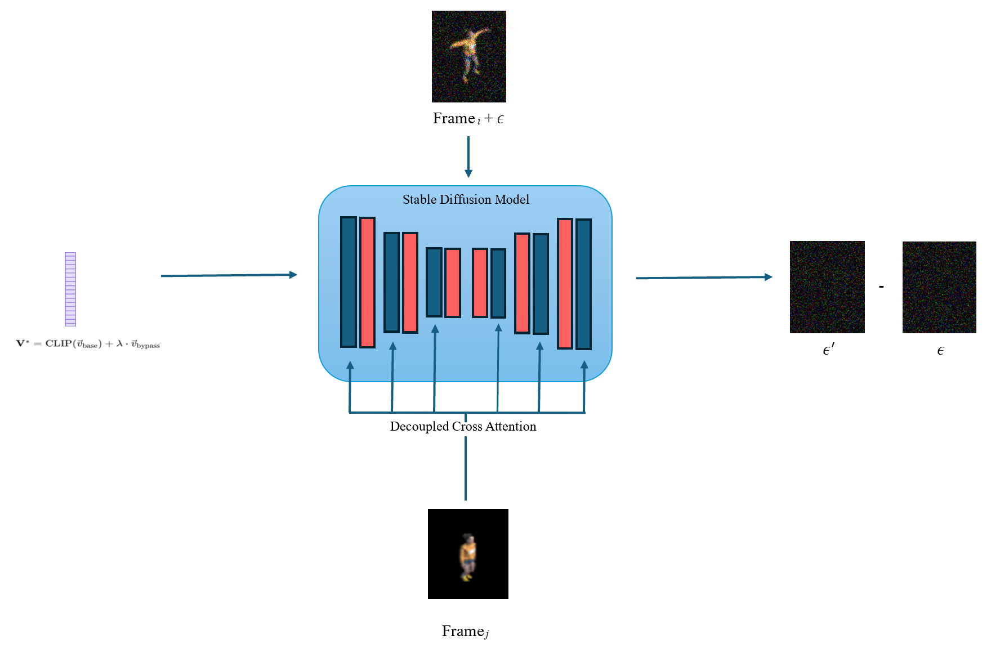

<h1 align="center">4Distillation</h1>
<h3 align="center">Joint Time and View Control via 4D-to-2D Distillation of Spatiotemporal Implicit Representations</h3>

This repository presents **4Distillation**, a novel method for distilling knowledge from 4D reconstruction models into a 2D diffusion model.  
Our approach enables **joint control over time and viewpoint** in text-to-image generation.

---

## Method

We introduce a distillation-based framework that transfers temporal and viewpoint understanding from 4D data into a 2D generative model (e.g., Stable Diffusion). 

The overview in the figure focuses on the temporal dimension, but the viewpoint dimension is learned in a fully analogous manner using a View Mapper instead of a Time Mapper, and conditioning on the relative camera pose difference instead of the frame index difference.

---

### Step 1: Sampling Temporal Pairs from Videos

  

---

### Step 2: Time Mapper — Encoding Motion

  

Following the NeTI approach, to maintain the editability–fidelity trade-off and to constrain **v_bypass** from becoming too dominant, the textual condition **v\*** is calculated as:

  

---

### Step 3: Temporal Knowledge Distillation into the Time Mapper via the 2D Diffusion Model

  

---
## Acknowledgments

This project builds upon and incorporates methods from the following works:

- [NeTI](https://arxiv.org/abs/2305.15391)
- [ViewNeTI](https://arxiv.org/abs/2309.07986)
- [IPAdapter](https://arxiv.org/abs/2308.06721)

- [IP-Adapter by Tencent AI Lab](https://github.com/tencent-ailab/IP-Adapter)  
- [ComfyUI IPAdapter Plus by cubiq](https://github.com/cubiq/ComfyUI_IPAdapter_plus)

We gratefully acknowledge the original authors for their contributions.  
All original code, models, and methods remain the property of their respective creators.

Copyright Notice:
This project utilizes methods, code, and ideas from various sources, including NeTI, ViewNeTI, IPAdapter, and others.
All rights to the original methods and code remain with their respective owners.
Some sources or authors may not be explicitly mentioned here. If any copyright concerns arise, please contact me so I can address them promptly.

